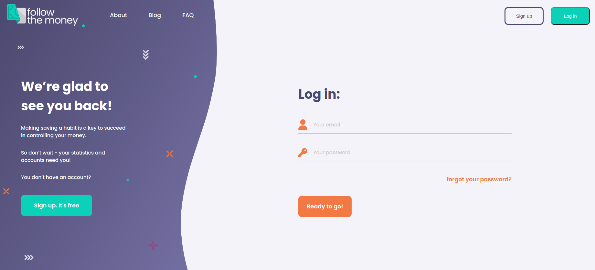
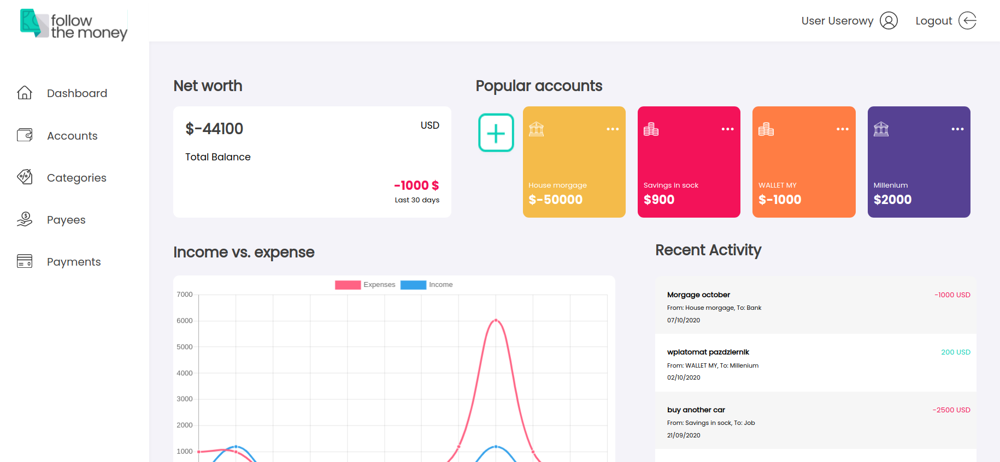
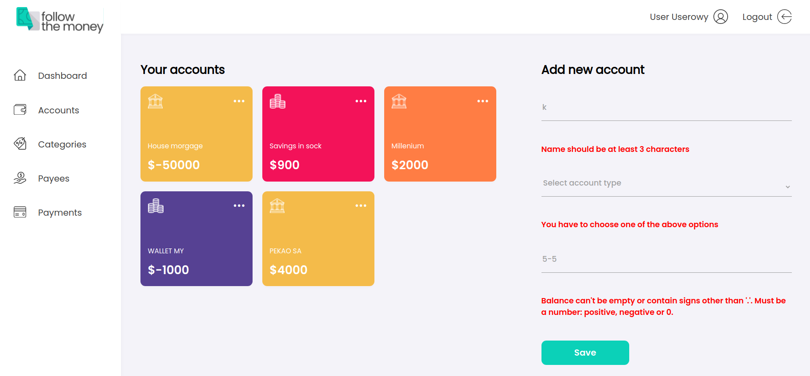
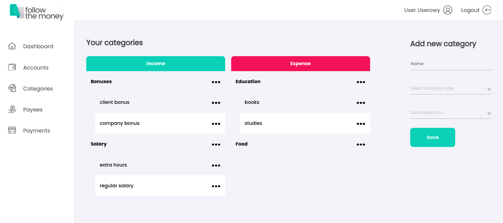
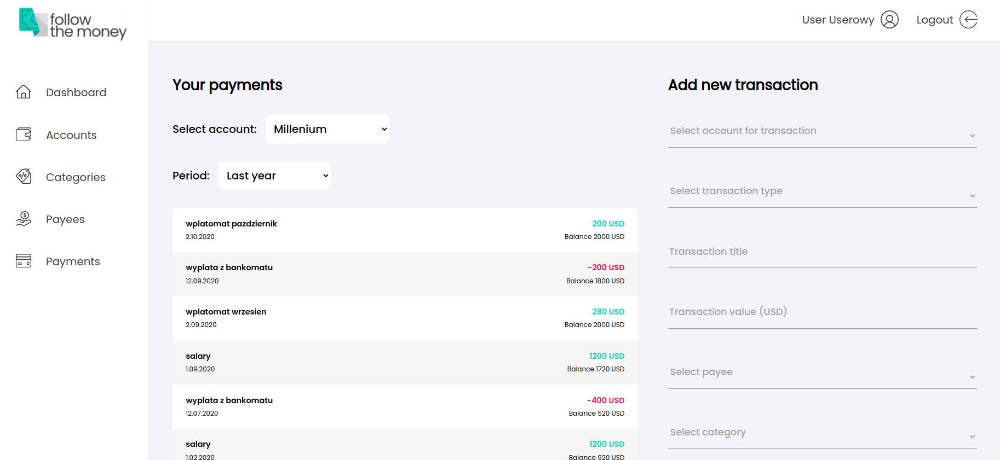
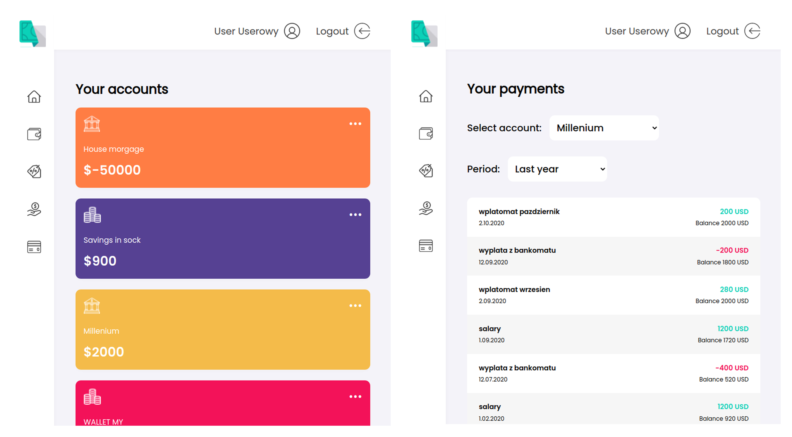
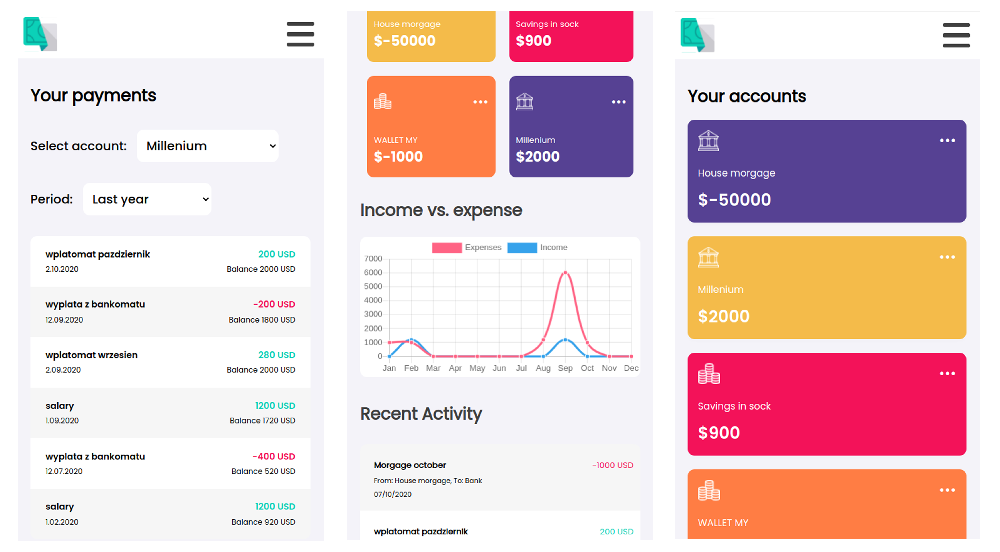

# Follow-the-money-Spring-Angular-web-application
Follow The Money is **a full-stack REST application for budgeting** - users can manage their accounts, payees, categories and transaction, and see the statistics accordingly.

The application has been created in the team of 2 CodeCool students in the final, advance module of the course. The project lasted 2.5 months and covered all stages of app planning and development:
* idea and business logic
* graphic design and UI
* database design
* project architecture choices
* front-end development
* back-end development
* dev-ops basics
* learning new technologies

## Features
### Register and log in to the app

Using Spring Security and Angular configuration, the user authentication and authorization mechanisms were implemented and CORS settings were configured.

The application uses JWT authentication and cookies.

### See interactive dashboard with the summery of user's data

### See, add, modify and delete user's accounts

The accounts are divided into bank and cash accounts. 

All the forms in the application are fully validated, both by Angular and Spring.

### See, add, modify and delete user's payees and categories

Both are needed to categorize transactions, and have similar graphic layout: 

### See, add, modify and delete user's payments (transactions)

The transactions can be observed divided by account and specified period.

## Responsiveness
All the views are adapted to all sizes of screens.
#### Tablet
 

#### Mobile

## Technologies
### Back-end
* Java 13
* Spring Boot
* Spring Security
* PostgreSQL
* Hibernate
* Junit 5
* Maven
* Mockito
* Docker
* Swagger

### Front-end
* HTML 5
* CSS
* Angular (TypeScript)
* ng-2 charts
* Figma (for graphic designs)

## Credits
Project supervised by Codecool mentors.
